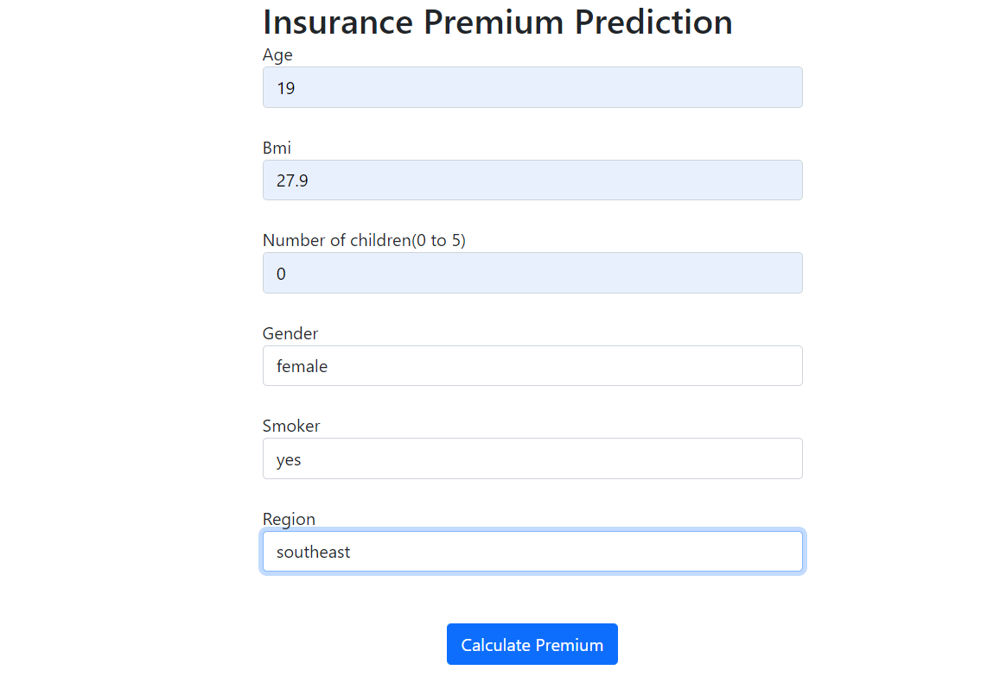

# Insurance Premium Prediction
The goal of this project is to give people an estimate of premium amount based on their individual health situation. Several models were test and finally RandomForestRegressor was selected with a r2_score of 0.85. Also hyper-parameter tuning waas performed to optimize the model.

## Webpage link: [link](https://insurance111.herokuapp.com/)

## Screenshot

